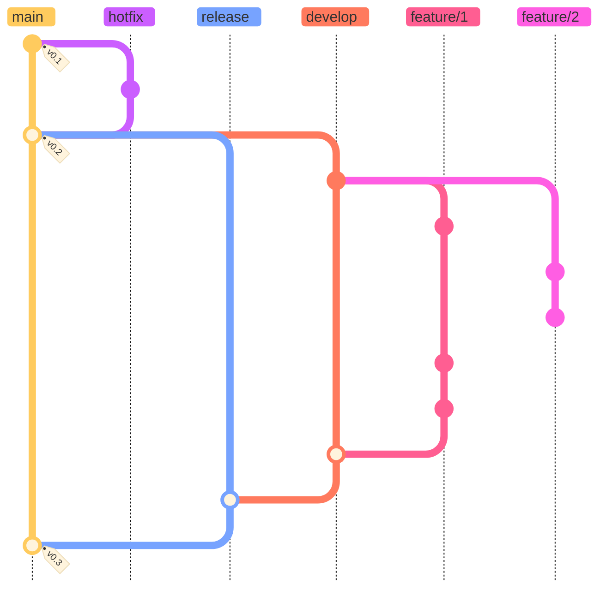

## Git Flow

```mermaid
%%{init: {'logLevel': 'debug','theme': 'base','gitGraph': {'showCommitLabel': false}}}%%
gitGraph TB:
    commit tag: "v0.1"
    branch hotfix
    commit
    checkout main
    merge hotfix tag: "v0.2"
    branch release
    branch develop
    checkout develop
    commit
    branch feature/1
    commit
    checkout develop
    branch feature/2
    commit
    commit
    checkout feature/1
    commit
    commit
    checkout develop
    merge feature/1
    checkout release
    merge develop
    checkout main
    merge release tag: "v0.3"
```