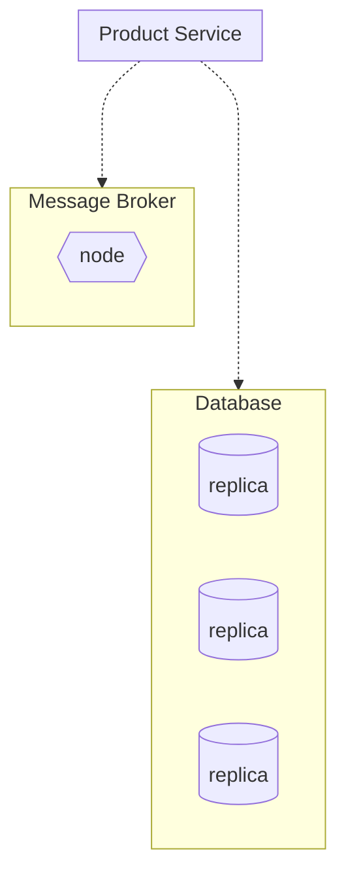

```mermaid
flowchart TD
    subgraph ProductService[Product Service]
    end

    subgraph MessageBroker[Message Broker]
        MessageBroker-Node1{{node}}
    end
    
    subgraph Database[Database]
        Database-Replica1[(replica)]
        Database-Replica2[(replica)]
        Database-Replica3[(replica)]
    end

    %% integrations
    ProductService -..-> MessageBroker
    ProductService -...-> Database
```